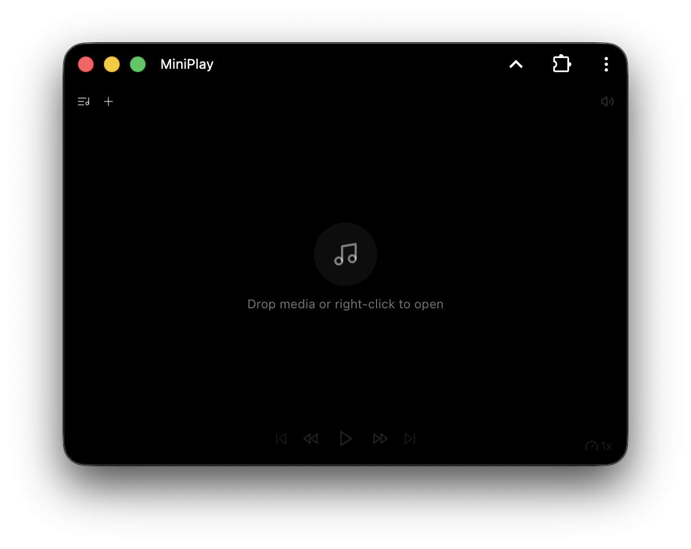
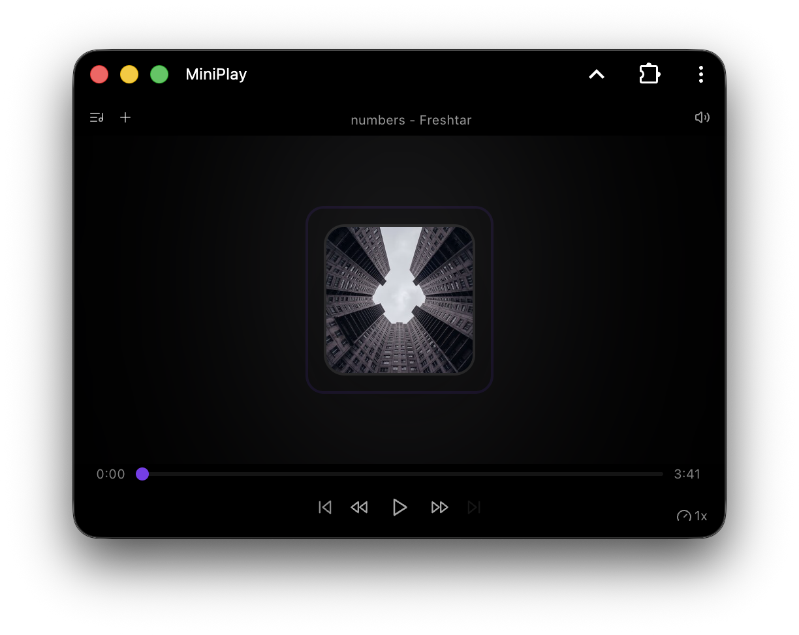
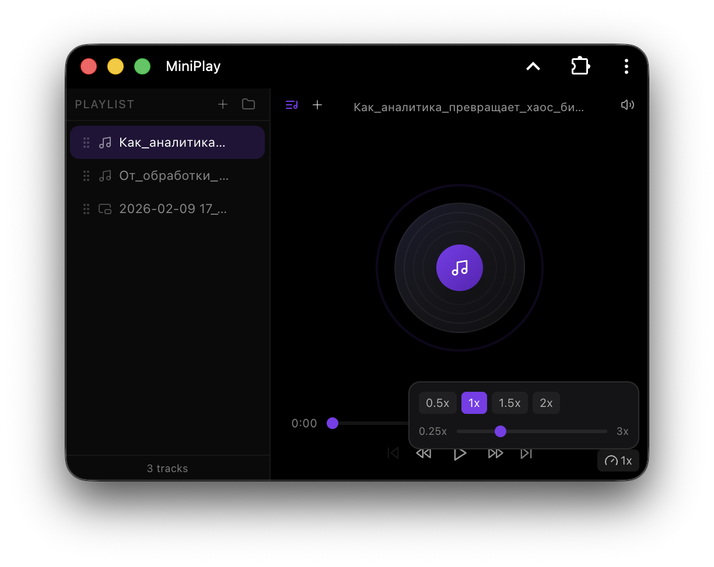

# MiniPlay

A minimalistic offline media player PWA (Progressive Web App) built with Next.js, React, and Tailwind CSS.

## Features

- 🎵 **Offline Support** – Works completely offline with service worker
- 📱 **PWA Ready** – Installable as a web app on any device
- 🎨 **Minimal UI** – Clean, distraction-free interface
- 🎧 **Audio Support** – MP3, WAV, OGG, FLAC, AAC, M4A, WMA, WebM, Opus
- 🎬 **Video Support** – MP4, WebM, OGG, MOV
- ⚡ **Fast** – Optimized static site, instant load times
- 🌙 **Dark Mode** – Easy on the eyes

## Quick Start

### Development

```bash
bun install
bun run dev
```

Visit `http://localhost:3000`

### Build for Production

```bash
bun run build
bun run start
```

The static site will be generated in the `docs/` folder, ready for GitHub Pages or any static host.

## Demo

Start screen:


Album cover:


Playlist:


https://e1turin.github.io/MiniPlay/

## Tech Stack

- **Framework** – Next.js 16 (App Router)
- **UI Components** – shadcn/ui
- **Styling** – Tailwind CSS
- **State Management** – Zustand
- **Icons** – Lucide React
